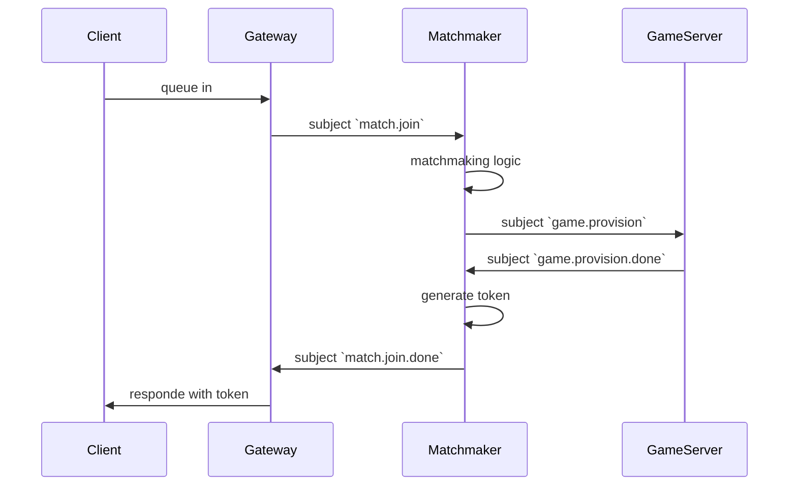

# Typephoon V2
A redesign of the previous [Typephoon](https://github.com/AlexFangSW/Typephoon_api) project.  
Simplified architecture and implimentation while also preserving scallability and performance.

## Goal for V2
The main goal of version 2 is to **remove** the need of **event broadcast for in-game events**.

In version 1 we only have a single backend service, when scaled up, users in the same game
might be connected to different servers, to solve this, we connect servers to RabbitMQ
and boadcasted in game events.  

This works, but servers need to filter out useless events.  

The main difference between version 1 is that the backend is no longer a single service,
we have seperated functions that needed event broadcast into their sepereate services, 
the backend now consists of three services:
- API
- Matchmaker
- Game Server

Aside from that, all services now comminicate through [NATS](https://nats.io/).
A high-performance, lightweight, open-source messaging system.

In NATS, messages are routed by their **subjects**.  
It is stated in the docs that [NATS can manage 10s of millions of subjects](https://docs.nats.io/nats-concepts/subjects#number-of-subjects).  
Version 2 utilizes this to **eliminate the need for broadcast**.

## Architecture

### API Service
Entrypoint for all requests.  

The web page will also be served here, we will still be using a frontend framework, but it will be built and 
served on one of the endpoints.  

### Matchmaker
Handle matchmaking logic.  

It is designed with **Active-Passive** architecture, this way all matchmaking logic
stays in the same server, no need for extra communication.  
With standby servers, the failover shouldn't be too slow.

### Game Server
Players in the same game will connect to the same game server, a single game server can host multiple games, 
it is the source of truth for all events, players will be corrected if any missmatch happens.

## Workflows
### Matchmaking Sequence

