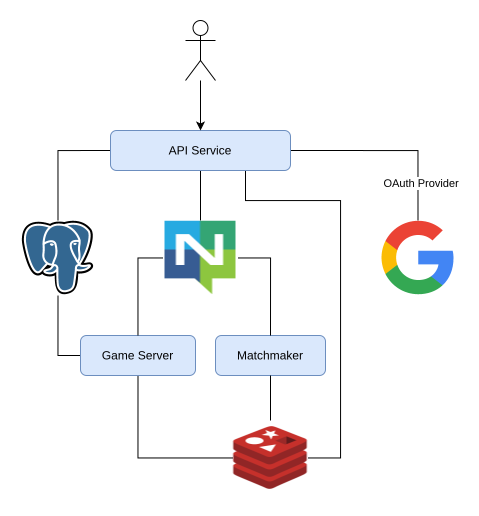
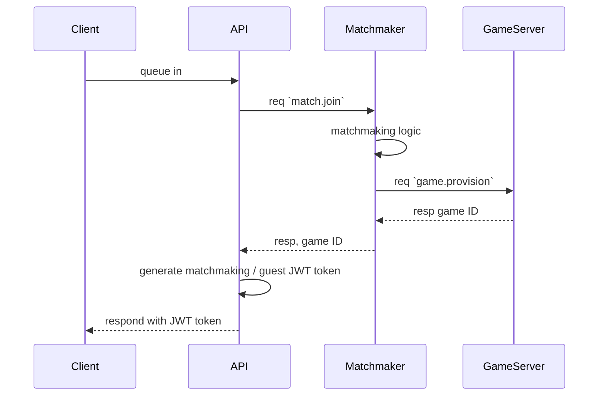

# Typephoon V2
A redesign of the previous [Typephoon](https://github.com/AlexFangSW/Typephoon_api) project.  
Simplified architecture and implimentation while also preserving scallability and performance.

## Goal for V2
The main goal of version 2 is to **minimize** the need of **event broadcast**.

In version 1 we only have a single backend service, when scaled up, users in the same game
might be connected to different servers, to solve this, we connect servers to RabbitMQ
and boadcasted in game events.  

This works, but servers need to filter out useless events.  

The main difference between version 1 is that the backend is no longer a single service,
we have seperated functions that needed event broadcast into their sepereate services, 
the backend now consists of three services:
- API
- Matchmaker
- Game Server

Aside from that, all services now comminicate through [NATS](https://nats.io/).  
A high-performance, lightweight, open-source messaging system.

In NATS, messages are routed by their **subjects**.  
It is stated in the docs that [NATS can manage 10s of millions of subjects](https://docs.nats.io/nats-concepts/subjects#number-of-subjects).  
Version 2 utilizes this to **minimize broadcast**.

**Broadcast still exist, but only recived by those who need it.**

## Architecture

### API Service
Entrypoint for all client traffic (HTTP + WebSocket). **Stateless**, can scale horizontally.

API Documentation: [Link](./docs/api/README.md)

#### Responsibilities
- **Serves the frontend**: built SPA served on an endpoint.
- **Authentication**: handles all token creation and validation. 
- **Matchmaking relay**: receives queue-in requests from clients, publishes to NATS,
  and returns the matchmaking JWT to the client.
- **In-game WebSocket bridge**: acts as a pure pass-through between the client (WebSocket)
  and the Game Server (NATS), using the matchmaking JWT to resolve which subjects to use.

#### JWT Tokens
Two separate JWT tokens are used:
- **Auth JWT**: identifies the user. Issued on login, or auto-generated for guest users
  when they queue in. Returned to the client for subsequent requests.
- **Matchmaking JWT**: generated when match is found, returned to the client through the API.
  Contains user identity **plus** game connection info (game ID for resolving NATS subjects).

#### In-game Connection
The API service is a **pure pass-through**, it does not process or validate game events.
The Game Server is the source of truth and signals game completion through NATS,
which the API forwards to the client.

### Matchmaker
Handles matchmaking logic. Listens on NATS for queue events, groups players into matches,
provisions a Game Server, and returns a matchmaking JWT to each player through the API.

Designed with **Active-Passive** architecture, all matchmaking logic stays in a single
active instance (lock acquired via Redis). Standby instances provide failover.
The queue lives entirely in-memory, if the active instance goes down, queued players
are disconnected and must re-queue.

#### Responsibilities
- **Queue management**: listens on `match.join` / `match.leave` subject.
  Maintains a single in-memory FIFO queue of player events (join / leave).
- **Match formation**: a single background worker continuously consumes the queue.
  When `match_size` players are available, a match is formed immediately.
  If a partial group has been waiting longer than `match_timeout`, the match starts
  with fewer players.
- **Game provisioning**: sends a `game.provision` request (NATS req-resp) containing
  the player list. All Game Servers share a queue group so exactly one
  handles the request. If no Game Server responds, all players in the match are
  disconnected with an error.

### Game Server
Hosts typing games. A single instance can run multiple games concurrently, each managed
by its own background task. There is no shared state between instances, all game state
lives in-memory, can scale horizontally.

#### Responsibilities
- **Game provisioning**: subscribes to `game.provision` (NATS queue group, req-resp).
  On receiving a request, creates a Redis entry at `game:<gameID>` with all players'
  status (JSON, TTL 10 min: refreshed on every update).
  Responds with the game ID.
- **Game lifecycle**: a background task is created when the first player connects.
  A countdown (default 5s) starts, then the game begins. The game ends when all players
  finish, disconnect, or the game timeout is reached (default 10 min, configurable).
- **Text generation**: generates the typing content for each game.
- **Input validation**: on each keystroke, the client sends position and current input.
  The server stores this and checks correctness. If the position is wrong, the server
  sends a correction (full current input string) and the client snaps back.
  A player finishes when the last word is typed correctly.
- **Event broadcasting**: sends events to all players in the game via `game.<ID>.out.<event>.<playerID>`:
  countdown, game start, player keystrokes, correction, player finish, game over.
  Receives player input via `game.<ID>.in.<event>`.
- **Result storage**: updates the Redis entry with WPM, accuracy, and finish time
  as each player completes. The frontend polls these results through the API service.
  If the player is logged in, the result is also stored in the database.

## Workflows
### Matchmaking Sequence

### In-game Sequence
After aquiring the JWT token, the client connect to the game through the API service.  
API service uses the JWT token provided to find which subject to listen.  

- API Service -> Game Server: `game.<ID>.in.<event>`  
- Game Server -> API Service: `game.<ID>.out.<event>.<playerID>`  

This two subject will run in parallel, they are not sequantial.
