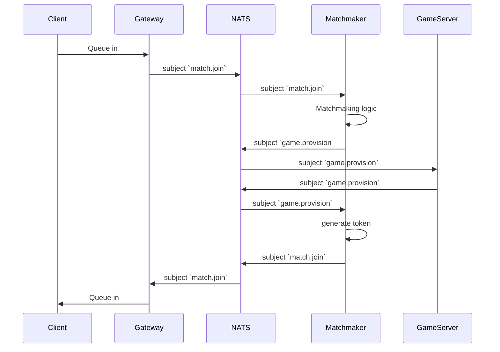

# Typephoon V2
A redesign of the previous [Typephoon](https://github.com/AlexFangSW/Typephoon_api) project.  
Simplified architecture and implimentation while also preserving scallability and performance.

## Architecture

### Gateway
- Provide authorization on incomming requests
- Coordinate with **matchmaker** and **game server** through [NATS](https://nats.io/)

### General Server
Serves general APIs for things like "user profile", "authentication" ... etc.  

The web page will also be served here, we will still be using a frontend framework, but it will be built and 
served on one of the endpoints.

### Matchmaking Service
Handle matchmaking logic, when match is found, send a message through NATS to 
notify game servers.  

### Game Server
A simgle game server can host multiple games, it is the source of truth for all
events, players will be corrected if any missmatch happens.

## Workflows
### Matchmaking Sequence

