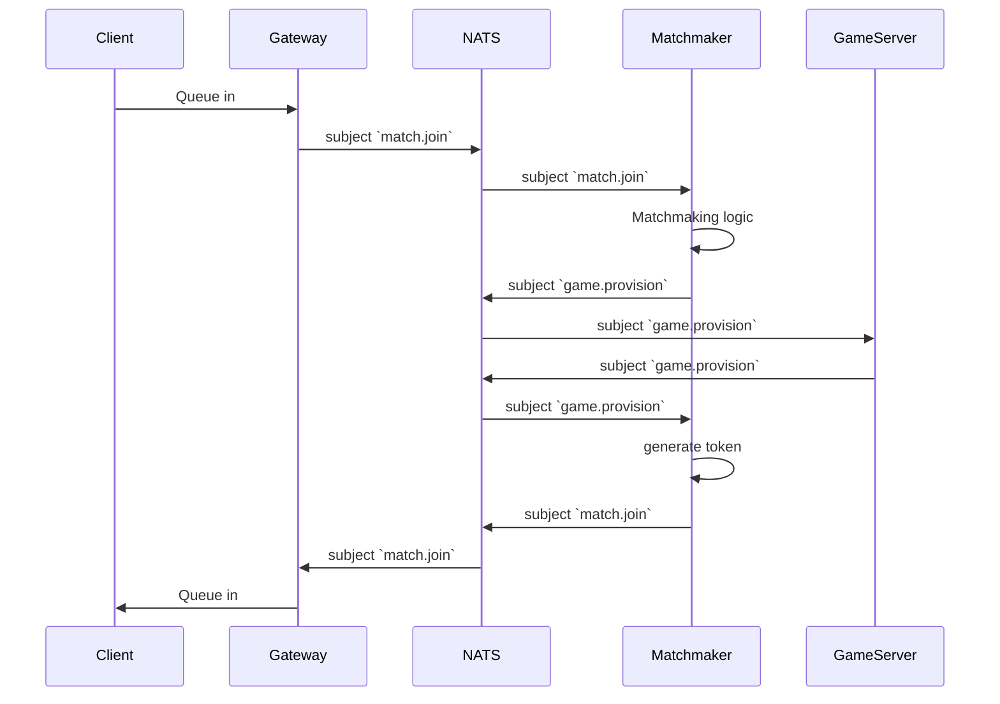

# Typephoon V2
A redesign of the previous [Typephoon](https://github.com/AlexFangSW/Typephoon_api) project.  
Simplified architecture and implimentation while also preserving scallability and performance.

The main goal of version 2 is to remove the need of **event broadcast**.  

In version 1 we only have a single backend service, when scaled up, users in the same game
might be connected to different servers, to solve this, we connect servers to **RabbitMQ**
and boadcasted in game events.  

This works, but servers need to filter out useless events.  

The main difference to version 1 is that the backend is no longer a single service,
we have seperated functions that needed event broadcast into their sepereate services:
- Matchmaker
- Game Server

... TODO, something related to NATS

## Architecture

### API Service
Entrypoint for all requests.  

The web page will also be served here, we will still be using a frontend framework, but it will be built and 
served on one of the endpoints.  

Coordinate with **matchmaker** and **game server** through [NATS](https://nats.io/).  

### Matchmaker
Handle matchmaking logic.  

It is designed with **Active-Passive** architecture, this way all matchmaking logic
stays in the same server, no need for extra communication.  
With standby servers, the failover shouldn't be too slow.

### Game Server
A simgle game server can host multiple games, it is the source of truth for all
events, players will be corrected if any missmatch happens.

## Workflows
### Matchmaking Sequence

